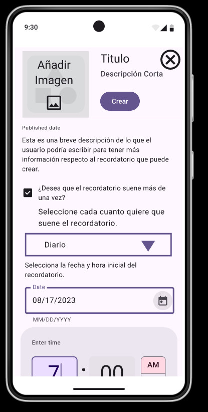

# Diseño de interfaz de usuario

La interfaz de usuario de la aplicación Yuko esta inspirada en el uso de [Plantillas de Figma](https://www.figma.com/es-la/templates/).

El diseño completo esta disponible
en [Figma](https://www.figma.com/proto/Cx41GdqTCs8SP7D4XaCZmG/Yuko-App?node-id=29-396&node-type=FRAME&t=BnPOQGXT4OVW12V8-0&scaling=scale-down&content-scaling=fixed&page-id=0%3A1&starting-point-node-id=3%3A12).

Los colores a usar estarán basados en una combinación de colores vivos con colores rusticos de madera. A continuación se
presentan las principales pantallas:

1. Recordatorios

   Cuando el usuario ingrese a la aplicaicón verá una lista con los recordatorios que ha creado
   en una lista del más reciente al más antiguo.

   
   

3. Crear recordatorio

   Cuando el usuario cree un recordatorio podra ponerle descripción, titulo fecha y hora de recordatorio.

   
   

5. Recordatorio intermietente

   El usuario podra crear recordatorios que suenen más de una vez en caso de ser necesario
   como crear recordatorios de medicamentos ETC.

   
   

7. Modificadores de recordatorios

  El usuario podra modificar o eliminar el recordatorio oprimiendo en los 3 puntos
  
  

5. Eliminar y modificar
   
   En caso de ser necesario, el usuario podra eliminar y/o modificar el recordatorio que ya no necesite
   o que desee cambien por algúna razón accediendo al menú de los 3 puntos

  

  

6. Ingreso biometrico

   Para acceder al menú de ahorros se requerirá de acceso biométrico o mediante contraseña por ser datos sensibles
   del usuario.

   

7. Menú de ahorros

   El usuario podra visualizar su menú de ahorros en caso de tener un ahorro o si no tiene ahorros
   podra visualizar un botón para iniciar su ahorro

   

8. Crear ahorros

   El usuario podra crear un ahorro en el cual debe escoger con cuanta intensidad quiere ahorrar.
   
   
   
   
   

10. Menú hamburguesa

  El usuario dispondrá de un menú tipo hamburguesa para poder acceder fácilmente a apartados necesarios.
  
  
